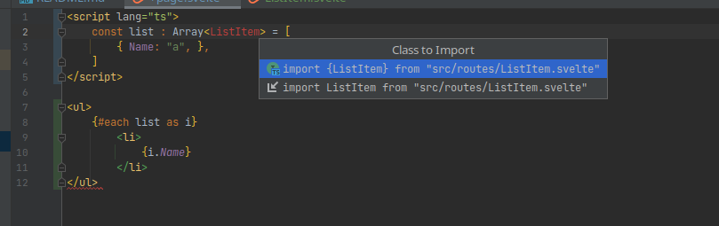
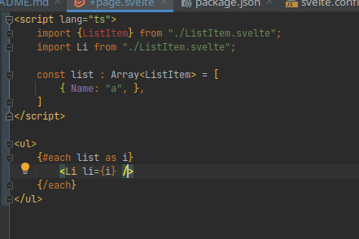
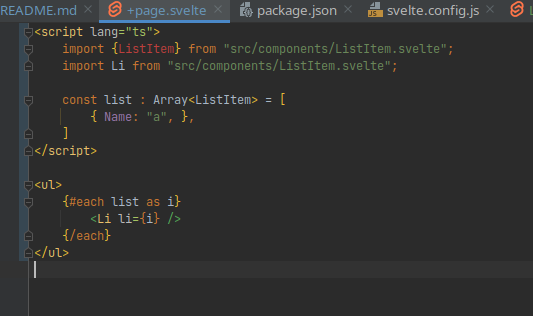

This repo represents a typescript / svelte issue with IntelliJ.

# Types in globals not found even though it knows that it is an option in auto import

# Import paths are incorrect when refactoring or using suggested imports:

